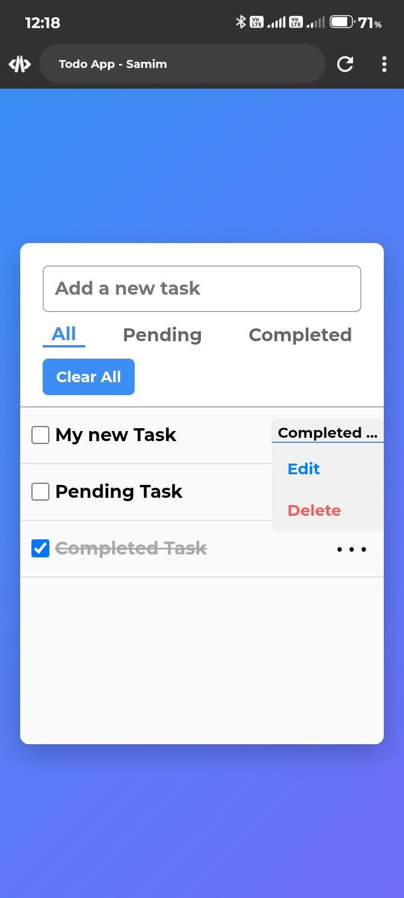
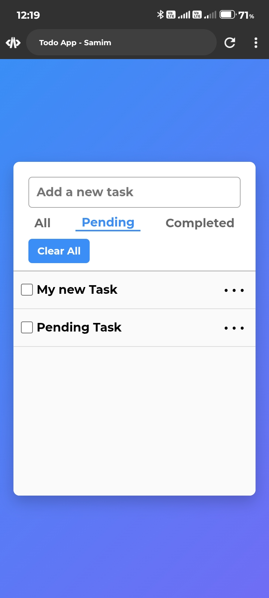
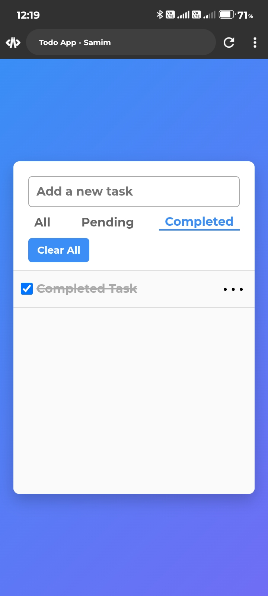

# ✅ Todo App - Samim

A clean, modern Todo application built using:

- **HTML, CSS, JavaScript**
- **IndexedDB** (for local database storage)

Includes tab-based filtering with smooth **slider transitions**, task editing, status updates, and deletion – all offline!

## 🔗 Demo

🌐 [Live Preview](https://iamsamimsarkar.github.io/Todo-App)

> Open the app directly in your browser – no installation required!

---

## 🔥 Features

- 📥 Add new tasks
- ✅ Mark tasks as completed
- 🖊️ Edit tasks inline
- 🗑️ Delete individual tasks or clear all
- 🧠 Persistent data storage using **IndexedDB**
- 🧭 Tab-based filtering: **All / Pending / Completed**
- 🎞️ Smooth tab slider animation
- 💎 Clean and responsive UI

---

## 📸 Screenshots

### ✅ All Tasks


### 🕓 Pending Tasks


### ✔️ Completed Tasks


---

## 🚀 Getting Started

### 1. Clone the Repository
```bash
https://github.com/iamsamimsarkar/Todo-App.git
cd Todo-App
```

### 2. Open the App
You can open the app directly in your browser:

```bash
# Using VS Code Live Server, or just open index.html manually
```

---

## 📂 Project Structure

```
todo-app/
│
├── index.html         # Main HTML file
├── style.css          # UI styling
├── script.js          # App logic
├── indexedDB.js       # IndexedDB wrapper
├── README.md          # This file
└── screenshots/       # Screenshots of the app
```

---

## 🧠 Technologies Used

- HTML5
- CSS3 (Flexbox, transitions)
- JavaScript (ES6+)
- IndexedDB API (via wrapper class)

---

## ✍️ Author

**Samim Sarkar**

- GitHub: [@iamsamimsarkar](https://github.com/iamsamimsarkar)

- Instagram: [@iamsamimreigns](https://www.instagram.com/iamsamimreigns)

- Facebook: [@iamsamimreigns](https://www.facebook.com/iamsamimreigns)
---

## 🪄 Future Improvements (Ideas)

- Add **Dark Mode**
- Drag-and-drop task sorting
- Due dates and reminders
- Export/import tasks as JSON
- Make it a **PWA** (installable)

---

## 📄 License

This project is open-source and available under the [MIT License](LICENSE).